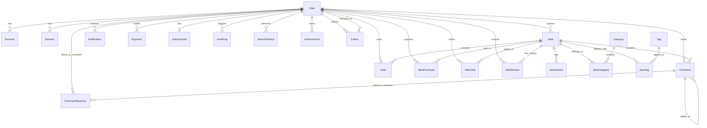

# 🗄️ Database Design — EcoVault

> Detailed database schema design, entity relationships, and indexing strategies for a scalable sustainability platform.

---

## 🏗️ Entity Relationship Diagram (ERD)



---

## 📜 Prisma Schema (Production Ready)

```prisma
// This is your Prisma schema file,
// learn more about it in the docs: https://pris.ly/d/prisma-schema

generator client {
  provider = "prisma-client-js"
  previewFeatures = ["fullTextSearch", "postgresqlExtensions"]
}

datasource db {
  provider = "postgresql"
  url      = env("DATABASE_URL")
}

// ============== ENUMS ==============

enum Role {
  MEMBER
  PREMIUM
  MODERATOR
  ADMIN
  SUPER_ADMIN
}

enum IdeaStatus {
  DRAFT
  UNDER_REVIEW
  APPROVED
  REJECTED
}

enum PaymentStatus {
  PENDING
  COMPLETED
  FAILED
  REFUNDED
}

enum NotificationType {
  IDEA_APPROVED
  IDEA_REJECTED
  NEW_COMMENT
  COMMENT_REPLY
  VOTE_MILESTONE
  PAYMENT_RECEIVED
  SYSTEM_ANNOUNCEMENT
}

enum SubscriptionTier {
  FREE
  BASIC
  PRO
  ENTERPRISE
}

enum ReactionType {
  LIKE
  LOVE
  INSIGHTFUL
  INSPIRING
  CONCERNED
}

// ============== AUTH MODELS (Better-Auth) ==============

model User {
  id              String           @id @default(cuid())
  email           String           @unique
  name            String
  emailVerified   Boolean          @default(false)
  image           String?          // Better-Auth standard image
  avatar          String?          // Custom user avatar
  bio             String?
  role            Role             @default(MEMBER)
  isActive        Boolean          @default(true)
  reputationScore Int              @default(0)

  // Better-Auth Relations
  accounts        Account[]
  sessions        Session[]

  // Application Relations
  ideas           Idea[]
  comments        Comment[]
  votes           Vote[]           // Standard voting for Ideas
  commentReactions CommentReaction[]
  notifications   Notification[]
  payments        Payment[]
  subscription    Subscription?
  webhooks        Webhook[]
  auditLogs       AuditLog[]       @relation("actor")
  searchHistory   SearchHistory[]
  purchasedIdeas  IdeaPurchase[]
  watchlist       Watchlist[]
  achievements    Achievement[]
  reviewsPerformed IdeaReview[]     @relation("reviewer")
  
  // Follow System
  followers       Follow[]         @relation("following")
  following       Follow[]         @relation("follower")

  createdAt       DateTime         @default(now())
  updatedAt       DateTime         @updatedAt

  @@index([email])
  @@index([role])
  @@map("users")
}

model Account {
  id                    String    @id @default(cuid())
  userId                String
  user                  User      @relation(fields: [userId], references: [id], onDelete: Cascade)
  accountId             String
  providerId            String
  accessToken           String?
  refreshToken          String?
  accessTokenExpiresAt  DateTime?
  refreshTokenExpiresAt DateTime?
  scope                 String?
  password              String?   // Hashed password for email provider
  createdAt             DateTime  @default(now())
  updatedAt             DateTime  @updatedAt

  @@unique([providerId, accountId])
  @@index([userId])
}

model Session {
  id        String   @id @default(cuid())
  userId    String
  user      User     @relation(fields: [userId], references: [id], onDelete: Cascade)
  token     String   @unique
  expiresAt DateTime
  ipAddress String?
  userAgent String?
  createdAt DateTime @default(now())
  updatedAt DateTime @updatedAt

  @@index([userId])
}

model Verification {
  id         String    @id @default(cuid())
  identifier String
  value      String
  expiresAt  DateTime
  createdAt  DateTime? @default(now())
  updatedAt  DateTime? @updatedAt
}

// ============== CORE BUSINESS MODELS ==============

model Idea {
  id              String           @id @default(cuid())
  title           String
  slug            String           @unique
  description     String           @db.Text
  problemStatement String          @db.Text
  proposedSolution String          @db.Text
  images          String[]         // Cloudinary/S3 URLs
  
  // Categorization & Labeling
  categories      IdeaCategory[]
  tags            IdeaTag[]
  
  // Ownership
  author          User             @relation(fields: [authorId], references: [id])
  authorId        String
  
  // Lifecycle
  status          IdeaStatus       @default(DRAFT)
  adminFeedback   String?          @db.Text
  reviewedBy      String?
  reviewedAt      DateTime?
  
  // Commercials
  isPaid          Boolean          @default(false)
  price           Float?           @default(0)
  
  // High-Impact/Featured
  isFeatured      Boolean          @default(false)
  featuredAt      DateTime?
  
  // Metrics (Denormalized for performance)
  viewCount       Int              @default(0)
  upvoteCount     Int              @default(0)
  downvoteCount   Int              @default(0)
  trendingScore   Float            @default(0)

  // Full-text search support (PostgreSQL specific)
  // Requires manual migration for GIN index
  searchVector    Unsupported("tsvector")?

  // Relations
  comments        Comment[]
  votes           Vote[]
  purchases       IdeaPurchase[]
  watchlists      Watchlist[]
  attachments     Attachment[]
  reviewHistory   IdeaReview[]

  createdAt       DateTime         @default(now())
  updatedAt       DateTime         @updatedAt
  publishedAt     DateTime?

  @@index([authorId])
  @@index([status])
  @@index([trendingScore(sort: Desc)])
  @@index([createdAt(sort: Desc)])
  @@map("ideas")
}

model Category {
  id              String           @id @default(cuid())
  name            String           @unique
  slug            String           @unique
  description     String?
  icon            String?          // Icon name or URL
  color           String?          // Hex color code
  isActive        Boolean          @default(true)
  ideas           IdeaCategory[]

  createdAt       DateTime         @default(now())
  updatedAt       DateTime         @updatedAt

  @@index([slug])
  @@map("categories")
}

model IdeaCategory {
  ideaId     String   @map("idea_id")
  categoryId String   @map("category_id")
  
  idea       Idea     @relation(fields: [ideaId], references: [id], onDelete: Cascade)
  category   Category @relation(fields: [categoryId], references: [id], onDelete: Cascade)

  assignedAt DateTime @default(now()) @map("assigned_at")

  @@id([ideaId, categoryId])
  @@index([categoryId])
  @@map("idea_categories")
}

model Tag {
  id              String           @id @default(cuid())
  name            String           @unique
  slug            String           @unique
  ideas           IdeaTag[]

  createdAt       DateTime         @default(now())
  updatedAt       DateTime         @updatedAt

  @@index([slug])
  @@map("tags")
}

model IdeaTag {
  ideaId String @map("idea_id")
  tagId  String @map("tag_id")

  idea Idea @relation(fields: [ideaId], references: [id], onDelete: Cascade)
  tag  Tag  @relation(fields: [tagId], references: [id], onDelete: Cascade)

  assignedAt DateTime @default(now()) @map("assigned_at")

  @@id([ideaId, tagId])
  @@index([tagId])
  @@map("idea_tags")
}

model Comment {
  id              String           @id @default(cuid())
  content         String           @db.Text
  
  author          User             @relation(fields: [authorId], references: [id])
  authorId        String
  
  idea            Idea             @relation(fields: [ideaId], references: [id], onDelete: Cascade)
  ideaId          String
  
  // Nested comments support
  parent          Comment?         @relation("CommentReplies", fields: [parentId], references: [id])
  parentId        String?
  replies         Comment[]        @relation("CommentReplies")
  
  isDeleted       Boolean          @default(false)
  isFlagged       Boolean          @default(false)

  createdAt       DateTime         @default(now())
  updatedAt       DateTime         @updatedAt

  reactions       CommentReaction[]

  @@index([ideaId])
  @@index([parentId])
  @@index([authorId])
}

model Vote {
  id              String           @id @default(cuid())
  value           Int              // 1 for upvote, -1 for downvote
  
  user            User             @relation(fields: [userId], references: [id])
  userId          String
  
  idea            Idea             @relation(fields: [ideaId], references: [id], onDelete: Cascade)
  ideaId          String

  createdAt       DateTime         @default(now())
  updatedAt       DateTime         @updatedAt

  @@unique([userId, ideaId])     // Ensuring one vote per user per idea
  @@index([ideaId])
}

// ============== FINANCIAL MODELS ==============

model Payment {
  id              String           @id @default(cuid())
  amount          Float
  currency        String           @default("BDT")
  status          PaymentStatus    @default(PENDING)
  transactionId   String?          @unique
  paymentMethod   String?          // sslcommerz, stripe, bKash
  
  user            User             @relation(fields: [userId], references: [id])
  userId          String
  
  metadata        Json?            // RAW response from gateway

  createdAt       DateTime         @default(now())
  updatedAt       DateTime         @updatedAt

  @@index([userId])
  @@index([status])
}

model IdeaPurchase {
  id              String           @id @default(cuid())
  user            User             @relation(fields: [userId], references: [id])
  userId          String
  idea            Idea             @relation(fields: [ideaId], references: [id])
  ideaId          String
  amount          Float
  paymentId       String           // Reference to Payment.id

  purchasedAt     DateTime         @default(now())

  @@unique([userId, ideaId])
}

model Subscription {
  id              String           @id @default(cuid())
  tier            SubscriptionTier @default(FREE)
  user            User             @relation(fields: [userId], references: [id])
  userId          String           @unique
  
  startDate       DateTime         @default(now())
  endDate         DateTime?
  isActive        Boolean          @default(true)
  autoRenew       Boolean          @default(true)
  
  stripeSubId     String?          @unique

  createdAt       DateTime         @default(now())
  updatedAt       DateTime         @updatedAt
}

// ============== UTILITY MODELS ==============

model Notification {
  id              String           @id @default(cuid())
  type            NotificationType
  title           String
  message         String
  isRead          Boolean          @default(false)
  data            Json?            // { link: "/ideas/123", icon: "approval" }
  
  user            User             @relation(fields: [userId], references: [id])
  userId          String

  createdAt       DateTime         @default(now())

  @@index([userId, isRead])
}

model Webhook {
  id              String           @id @default(cuid())
  url             String
  secret          String           
  events          String[]         
  isActive        Boolean          @default(true)
  
  user            User             @relation(fields: [userId], references: [id])
  userId          String
  
  lastTriggered   DateTime?
  failureCount    Int              @default(0)
  deliveryLogs    WebhookDelivery[]

  createdAt       DateTime         @default(now())
  updatedAt       DateTime         @updatedAt
}

model WebhookDelivery {
  id              String           @id @default(cuid())
  webhook         Webhook          @relation(fields: [webhookId], references: [id])
  webhookId       String
  event           String
  payload         Json
  statusCode      Int?
  response        String?          @db.Text
  success         Boolean          @default(false)
  attempts        Int              @default(1)

  createdAt       DateTime         @default(now())
}

model AuditLog {
  id              String           @id @default(cuid())
  action          String           // CREATE, UPDATE, DELETE, etc.
  resource        String           // Idea, User, Comment
  resourceId      String
  
  actor           User             @relation("actor", fields: [actorId], references: [id])
  actorId         String
  
  previousState   Json?
  newState        Json?
  ipAddress       String?
  userAgent       String?

  createdAt       DateTime         @default(now())

  @@index([resource, resourceId])
  @@index([createdAt])
}

model SearchHistory {
  id              String           @id @default(cuid())
  query           String
  resultsCount    Int
  
  user            User             @relation(fields: [userId], references: [id])
  userId          String

  createdAt       DateTime         @default(now())
}

model CommentReaction {
  userId     String       @map("user_id")
  commentId  String       @map("comment_id")
  type       ReactionType

  user       User         @relation(fields: [userId], references: [id], onDelete: Cascade)
  comment    Comment      @relation(fields: [commentId], references: [id], onDelete: Cascade)

  createdAt  DateTime     @default(now()) @map("created_at")

  @@id([userId, commentId])
  @@index([ideaId])
  @@map("comment_reactions")
}

model Follow {
  followerId  String @map("follower_id")
  followingId String @map("following_id")

  follower  User @relation("follower", fields: [followerId], references: [id], onDelete: Cascade)
  following User @relation("following", fields: [followingId], references: [id], onDelete: Cascade)

  createdAt DateTime @default(now()) @map("created_at")

  @@id([followerId, followingId])
  @@index([followingId])
  @@map("follows")
}

model Newsletter {
  id              String           @id @default(cuid())
  email           String           @unique
  isSubscribed    Boolean          @default(true)

  createdAt       DateTime         @default(now())
  
  @@map("newsletters")
}

model Watchlist {
  id              String           @id @default(cuid())
  user            User             @relation(fields: [userId], references: [id], onDelete: Cascade)
  userId          String
  idea            Idea             @relation(fields: [ideaId], references: [id], onDelete: Cascade)
  ideaId          String

  createdAt       DateTime         @default(now())

  @@unique([userId, ideaId])
  @@index([userId])
}

model Attachment {
  id              String           @id @default(cuid())
  type            String           // VIDEO, PDF, DOCUMENT
  url             String
  title           String?
  idea            Idea             @relation(fields: [ideaId], references: [id], onDelete: Cascade)
  ideaId          String

  createdAt       DateTime         @default(now())
}

model IdeaReview {
  id              String           @id @default(cuid())
  idea            Idea             @relation(fields: [ideaId], references: [id], onDelete: Cascade)
  ideaId          String
  reviewer        User             @relation("reviewer", fields: [reviewerId], references: [id])
  reviewerId      String
  status          IdeaStatus
  feedback        String           @db.Text
  
  createdAt       DateTime         @default(now())

  @@index([ideaId])
}

model Achievement {
  id              String           @id @default(cuid())
  name            String
  description     String
  icon            String?
  user            User             @relation(fields: [userId], references: [id], onDelete: Cascade)
  userId          String

  earnedAt        DateTime         @default(now())

  @@index([userId])
}
```

---

## ⚡ Indexing & Optimization Strategy

| Strategy | Applied to | Benefit |
|----------|------------|---------|
| **Composite Unique Index** | `Vote(userId, ideaId)` | Prevents duplicate votes at DB level. |
| **Sorted Index** | `Idea(trendingScore DESC)` | Ultra-fast retrieval of trending ideas. |
| **Sorted Index** | `Idea(createdAt DESC)` | Fast retrieval of latest ideas. |
| **Text Search Index (GIN)** | `Idea(searchVector)` | High-performance full-text search. |
| **Foreign Key Indexes** | All relations | Optimized joins and filtering. |
| **Partial Indexes** | `Notification(userId) where isRead = false` | Fast lookup of unread notifications. |

---

## 🔒 Security Measures

1. **Delete Cascade**: Comments and Votes are deleted when an Idea is deleted.
2. **Soft Deletes**: Comments use `isDeleted` flag instead of point-deletion to preserve nested thread structure.
3. **Data Integrity**: Enums used for Roles, Statuses, and Tiers to prevent invalid data.
4. **Audit Trail**: Every critical state change (Idea approval, Role change) is logged in `AuditLog`.
